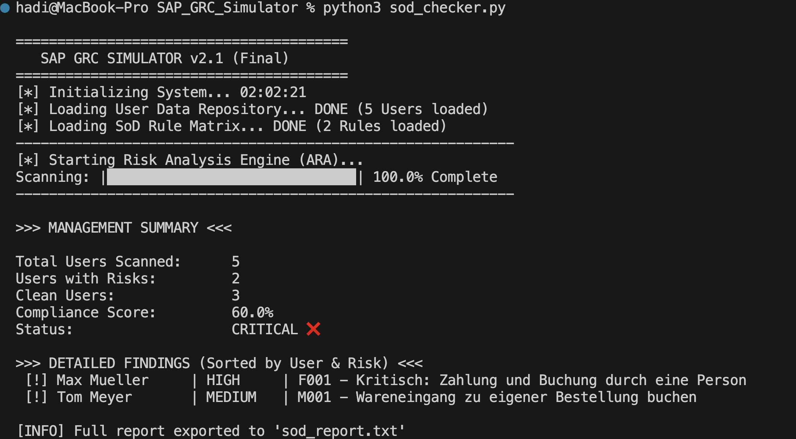

# SAP GRC SoD Simulator 🛡️

### 🎯 Projektziel
Dieses Tool wurde entwickelt, um die Logik von **SAP GRC Access Control (ARA)** technisch zu simulieren. Es demonstriert, wie **Segregation of Duties (SoD)**-Prüfungen automatisiert durchgeführt werden können, indem Benutzerberechtigungen gegen eine Risikomatrix abgeglichen werden.

### 🚀 Features
* **Risk Analysis Engine:** Identifiziert Konflikte zwischen Benutzerrollen (z.B. *Bestellung* + *Wareneingang*).
* **Compliance Reporting:** Generiert einen Audit-Report mit Management-Summary und Compliance-Score.
* **Enterprise Simulation:** Simuliert Ladezeiten und Prozessschritte für eine realistische Terminal-Experience.
* **Robustes Design:** Enthält Error-Handling, Type Hints und modulare Struktur.

### 🛠 Technologie
* **Python 3.x** (Keine externen Libraries nötig)
* **CSV-Verarbeitung** (Simulation von SAP-Tabellenexporten wie `AGR_USERS`)
* **Algorithmus:** Mengenbasierter Abgleich (Set Intersection) für O(1) Performance bei Rollen-Checks.

### 📂 Projektstruktur
* `sod_checker.py`: Die Hauptlogik (Engine).
* `users.csv`: Simulierter Export der User-Rollen (Ist-Zustand).
* `sod_matrix.csv`: Das Regelwerk / Rule Set (Soll-Zustand).
* `sod_report.txt`: Der generierte Audit-Bericht.

### 🔮 Future Roadmap (Erweiterungsideen)
Um dieses Tool in einer produktiven CI/CD-Umgebung einzusetzen, wären folgende Erweiterungen geplant:
* **Mitigation-Handling:** Implementierung einer Whitelist für genehmigte Ausnahmen.
* **REST API:** Bereitstellung als Microservice (z.B. mit FastAPI) für Echtzeit-Checks.
* **Unit Tests:** Automatisierte Tests mit `pytest` für die Prüf-Logik.

---
*Entwickelt als Proof-of-Concept (PoC) für SAP Security Anwendungen.*
